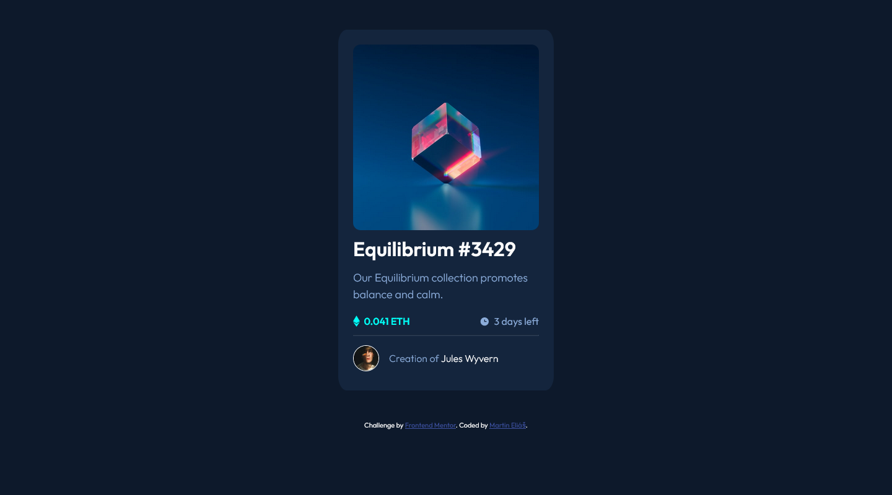
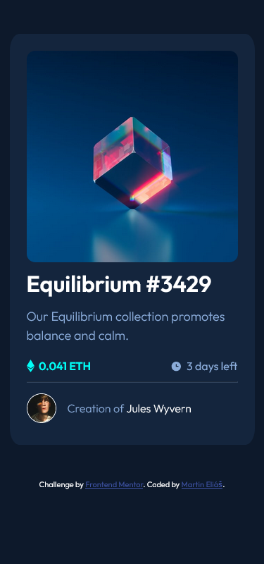

# Frontend Mentor - NFT preview card component solution

This is a solution to the [NFT preview card component challenge on Frontend Mentor](https://www.frontendmentor.io/challenges/nft-preview-card-component-SbdUL_w0U). Frontend Mentor challenges help you improve your coding skills by building realistic projects. 

## Table of contents

- [Overview](#overview)
  - [The challenge](#the-challenge)
  - [Screenshot](#screenshot)
  - [Links](#links)
- [My process](#my-process)
  - [Built with](#built-with)
  - [What I learned](#what-i-learned)
- [Author](#author)

## Overview

### The challenge

Users should be able to:

- View the optimal layout depending on their device's screen size
- See hover states for interactive elements

### Screenshot

### Links

- Solution URL: [https://www.frontendmentor.io/solutions/nft-preview-card-component-with-flexbox-opacity-multiple-backgrounds-IfZidTWRr](https://www.frontendmentor.io/solutions/nft-preview-card-component-with-flexbox-opacity-multiple-backgrounds-IfZidTWRr)
- Live Site URL: [https://nft-preview-card-component-main-five.vercel.app/](https://nft-preview-card-component-main-five.vercel.app/)

## My process

### Built with

- Semantic HTML5 markup
- CSS custom properties
- Flexbox
- Mobile-first workflow

### What I learned

I learned how can i use more pictures on hover effect with opacity.

## Author

- LinkedIn - [Martin Eliáš](https://www.linkedin.com/in/martin-eli%C3%A1%C5%A1-455550209/)
- Frontend Mentor - [@smradupan](https://www.frontendmentor.io/profile/smradupan)
